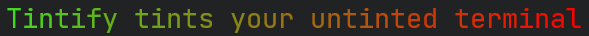
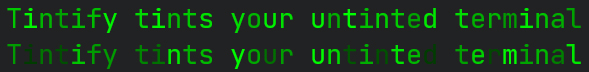
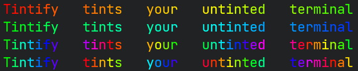

# Tintify
Tintify tints your untinted terminal

---

**Tintify** is an NPM package that bring you all you need to add colors and effects to your terminal !

This package isn't a simple list of ANSI escape sequences.
It bring you utilities functions that permit you to use custom RGB colors or the HEXADECIMAL notations.
In future update, we will bring you others functions like a new formaters. Current formatter permit you to transform your message into an **rainbow** text, a linear gradient between two colors, a matrix style text or a format function where you can pass flags to replace with a color *(ie: flag `§3` or `§b` will be transform to a color or effect according to the config)*

---
# Installation
```cmd
npm install tintify
```
OR
```cmd
pnpm install tintify
```

---
# Overview

## Basic usage
### Usage of constants
```js
import { forground, brightBackground } from "tintify";

console.log(`${forground.blue}Hello ${forground.red}${brightBackground.blue}World!`);
```


### Usage of functions
```js
import { forgroundRGBColor, backgroundRGBColor, hexToRgb } from "tintify";

const helloFgColor = forgroundRGBColor({red: 63, green: 112, blue: 84});
const worldFgColor = forgroundRGBColor(hexToRgb("#9d19c2"));
const worldBgColor = backgroundRGBColor({red: 63, green: 112, blue: 84});

console.log(`${helloFgColor}Hello ${worldFgColor}${worldBgColor}World!`);
```


## Formatters usage
### Linear gradient effect
```js
import { hexToRgb, linearGradient } from "tintify";

console.log(linearGradient("Tintify tints your untinted terminal", hexToRgb("#40db21"), {red: 255, green: 0, blue: 0}));
```


### Matrix effect
```js
import { hexToRgb, matrix } from "tintify";

console.log(matrix("Tintify tints your untinted terminal", hexToRgb("#00FF00")));
console.log(matrix("Tintify tints your untinted terminal", hexToRgb("#00FF00"), 200));
```


### Rainbow effect
```js
import { hexToRgb, rainbow } from "tintify";

console.log(rainbow("Tintify   tints   your   untinted   terminal"));
console.log(rainbow("Tintify   tints   your   untinted   terminal", hexToRgb("#00FF00")));
console.log(rainbow("Tintify   tints   your   untinted   terminal", hexToRgb("#00FF00"), 100));
console.log(rainbow("Tintify   tints   your   untinted   terminal", hexToRgb("#00FF00"), 100, false));
```


### Format
```js
import { defaultFormatConfig, forground, format } from "tintify";

console.log(format("§2Hello §b§4World!"));
console.log(format("§2Hello §b§4World!", {
  ...defaultFormatConfig,
  "§2": forground.blue
}));
```

